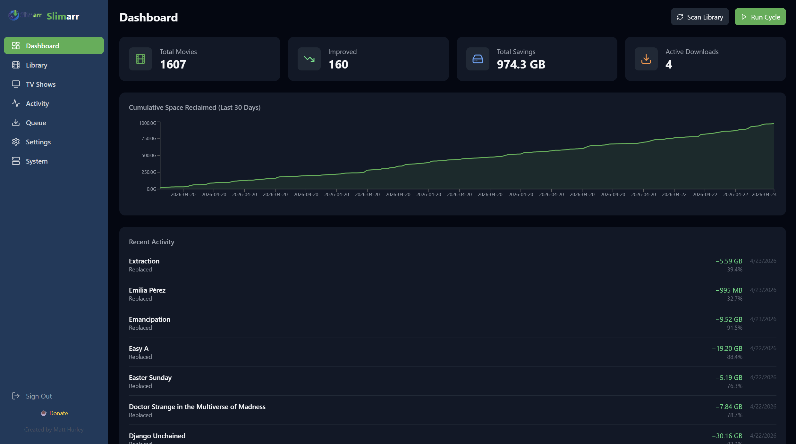
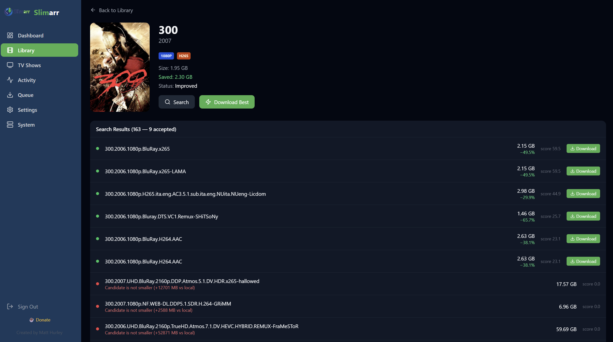
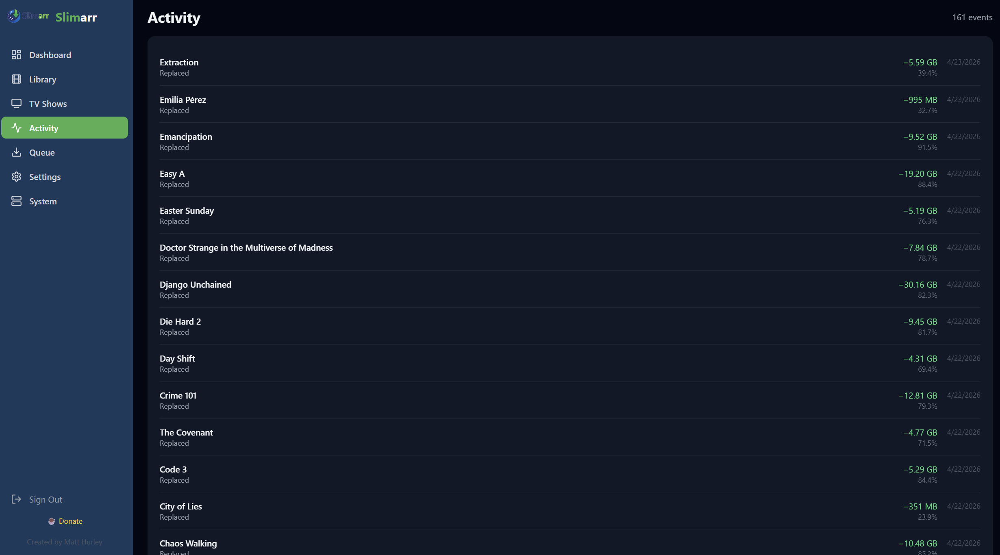
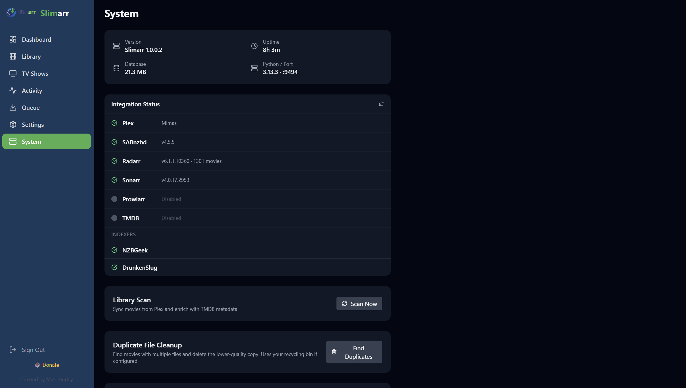

<p align="center">
  
</p>

<p align="center">
  <strong>Automatically shrink your Plex library — find smaller, better-compressed releases on Usenet and replace bloated files overnight.</strong>
</p>

<p align="center">
  
  
  
  
  
  
</p>

<p align="center">
  <a href="https://theantipopau.github.io/slimarr/">Project Website (GitHub Pages)</a>
</p>

---

## What is Slimarr?

Plex libraries accumulate large files over time — bloated remuxes, old h264 Blu-ray rips, and poorly compressed encodes. Modern codecs like **h265/HEVC** and **AV1** deliver equivalent or better visual quality at a fraction of the file size.

**Slimarr automates the entire replacement workflow:**

```
Scan Plex library → Search Usenet indexers → Compare releases
→ Queue download via SABnzbd or NZBGet → Replace file → Refresh Plex → Log savings
```

**Core rule: never increase file size.** A release is only accepted if it is strictly smaller than your existing copy.

Slimarr is designed to look and feel like a native member of the **\*arr ecosystem** (Radarr, Sonarr, Prowlarr). If you're familiar with those tools, you'll feel right at home.

Current stable release: **1.0.0.4**.

### What's New in 1.0.0.4

- Faster System health checks with cached, parallel integration probes
- Route-level frontend lazy loading and production chunk splitting
- Automation preflight checks before full-cycle start
- Queue page summary counters, status filters, timestamps, and responsive rows
- Installer packaging target: `SlimarrSetup-1.0.0.4.exe`

---

## Screenshots

| Dashboard | Movie Detail |
|-----------|--------------|
|  |  |

| Activity | System |
|----------|--------|
|  |  |

---

## Features

- **Nightly automation** — scheduled cycle searches, downloads and replaces movies while you sleep
- **Usenet search** — supports Prowlarr (recommended) or direct Newznab/NZBGeek indexers
- **Download client integration** — supports SABnzbd by default, with NZBGet support on the current `main` branch
- **Plex sync** — reads your library via PlexAPI, refreshes Plex after each replacement
- **TMDB enrichment** — posters, backdrops, and metadata fetched and cached locally
- **Smart comparison engine** — configurable minimum savings %, resolution downgrade protection, codec preferences, language filtering
- **Path mappings** — translate Plex-reported file paths to locally accessible paths when Plex and Slimarr run on different machines or use different mount points
- **Language filtering** — reject candidates in unwanted languages; prefer English (or any configured language)
- **AV1/h265 preference** — codec scoring bonus for modern efficient codecs
- **Minimum file size floor** — skip tiny low-quality candidates regardless of savings %
- **Real-time UI** — Socket.IO pushes scan progress, download progress, and replacement events to the browser instantly
- **Toast notifications** — non-intrusive feedback for every action
- **Recycling bin controls** — optionally move originals to a configured directory, monitor live usage in Settings, and empty it on demand
- **Duplicate file cleanup** — detect and remove inferior duplicate copies within your Plex library
- **TV Show Stale Media Sweeper** — Slimarr surfaces never-watched or long-unwatched TV shows with their disk footprint so *you* can decide what to delete; optionally unmonitors in Sonarr to prevent re-download
- **System tray** — runs as a Windows tray app with one-click open browser
- **Activity log** — full history of every replacement with old/new size and savings %
- **Update checker** — System page shows a badge when a newer version is available on GitHub
- **Radarr-compatible feel** — sidebar nav, poster grid, quality badges, test connection buttons

---

## Requirements

| Dependency | Version | Notes |
|------------|---------|-------|
| Python | 3.12+ | |
| Node.js | 18+ | For building the frontend |
| Plex Media Server | Any | PlexAPI token required |
| SABnzbd or NZBGet | Any | Configure at least one download client |
| Prowlarr **or** Newznab indexer | Any | At least one required |
| TMDB API key | Free | For posters and metadata |

---

## Installation (Windows)

### Option A — Installer (recommended for sharing)

Download `SlimarrSetup-1.0.0.4.exe` (or the latest `SlimarrSetup-*.exe`) from the [Releases](https://github.com/theantipopau/slimarr/releases) page and run it. The installer bundles Python and all dependencies — no manual setup required. After install, Slimarr appears in the Start Menu and optionally the system tray on login.

`1.0.0.4` is the latest published installer release. Newer `main` branch changes may land before the next installer is cut; if you want those immediately, run Slimarr from source or build a fresh installer from `main`.

### Option B — From source

**1. Clone the repository:**
```powershell
git clone https://github.com/theantipopau/slimarr.git C:\Slimarr
cd C:\Slimarr
```

**2. Run the installer:**
```powershell
.\install.ps1
```

The installer will:
- Create a Python virtual environment
- Install all Python dependencies
- Install Node.js frontend dependencies and build the React app

**3. Start Slimarr:**
```powershell
# With system tray (Windows default):
python run.py

# Headless (no tray):
python run.py --headless
```

**4. Open your browser to `http://localhost:9494`** and complete the one-time registration.

**5. Configure** your services in Settings — Plex, SABnzbd, TMDB, and at least one indexer are required.

### Keeping up to date

On machines that pull from git, run `update.bat` (or `git pull`). The System page shows a badge when a newer release is available.

## GitHub Pages Website

Slimarr includes a simple project website in `docs/` for GitHub Pages.

1. Push this repository to GitHub.
2. Open **Settings → Pages** in your GitHub repo.
3. Under **Build and deployment**, set:
  - **Source**: Deploy from a branch
  - **Branch**: `main`
  - **Folder**: `/docs`
4. Save and wait for deployment.

Your site URL will be:

`https://theantipopau.github.io/slimarr/`

---

## Configuration

`config.yaml` is created automatically on first run. Key sections:

```yaml
plex:
  url: "http://localhost:32400"
  token: "your-plex-token"
  library_sections:
    - "Movies"

sabnzbd:
  url: "http://localhost:8080"
  api_key: "your-sabnzbd-api-key"
  category: "slimarr"

download_client: "sabnzbd"   # "sabnzbd" or "nzbget"

nzbget:
  url: "http://localhost:6789"
  username: ""
  password: ""
  category: "slimarr"

prowlarr:
  enabled: true
  url: "http://localhost:9696"
  api_key: "your-prowlarr-api-key"

tmdb:
  api_key: "your-tmdb-api-key"

comparison:
  min_savings_percent: 10.0          # Reject candidates saving less than this
  allow_resolution_downgrade: false   # e.g. block 1080p → 720p replacements
  preferred_codecs: ["av1", "h265"]
  preferred_language: "english"       # Reject foreign-language releases
  minimum_file_size_mb: 500           # Ignore candidates below this size

radarr:
  enabled: false
  url: "http://localhost:7878"
  api_key: "your-radarr-api-key"

sonarr:
  enabled: false
  url: "http://localhost:8989"
  api_key: "your-sonarr-api-key"

files:
  recycling_bin: ""              # Leave empty to delete originals immediately (recommended).
                                 # Set a path (e.g. D:/recycle) to keep copies temporarily.
  recycling_bin_cleanup_days: 30 # Auto-delete recycled files older than this many days

  # Path mappings: use when Plex reports file paths that Slimarr can't
  # access directly (different machine, different drive letter/mount point).
  # plex_path: what Plex says  →  local_path: what Slimarr can write to
  plex_path_mappings: []
  # Example:
  # plex_path_mappings:
  #   - plex_path: "/data/media"
  #     local_path: "E:/media"

schedule:
  start_time: "01:00"   # UTC
  end_time: "07:00"
  max_downloads_per_night: 10
  throttle_seconds: 30
```

> **Note on disk space:** By default `recycling_bin` is empty, meaning old files are deleted immediately when a replacement succeeds. If you configure a recycling bin path, be aware that replaced movie files (typically 10–50 GB each) accumulate there until the nightly cleanup runs. Use a path on a drive with plenty of headroom, or leave the setting empty.

---

## Tech Stack

| Layer | Technology |
|-------|------------|
| Backend | Python 3.12, FastAPI, SQLAlchemy 2.0 async |
| Database | SQLite via aiosqlite |
| Real-time | python-socketio (Socket.IO) |
| Scheduling | APScheduler 3.10 |
| Frontend | React 18, TypeScript, Vite, Tailwind CSS |
| Plex | python-plexapi |
| HTTP client | httpx (async) |
| Auth | JWT (PyJWT) + bcrypt |
| Tray | pystray + Pillow |
| Sonarr | httpx REST client (v3 API) |

---

## Architecture

```
C:\Slimarr\
├── backend/
│   ├── api/          # FastAPI routers (library, queue, activity, settings, system, dashboard, tv)
│   ├── auth/         # JWT authentication
│   ├── core/         # Business logic (scanner, searcher, comparer, downloader, replacer, cleanup)
│   ├── integrations/ # Plex, SABnzbd, TMDB, Prowlarr, Newznab, Radarr, Sonarr clients
│   ├── realtime/     # Socket.IO instance and event emitter
│   ├── scheduler/    # APScheduler nightly job
│   └── main.py       # App entry point, static file serving
├── frontend/
│   └── src/
│       ├── pages/    # Dashboard, Library, MovieDetail, Queue, Activity, Settings, System, TVShows
│       ├── components/ # PosterCard, StatCard, QualityBadge, Toast, Sidebar, Layout
│       ├── hooks/    # useSocket, useAuth
│       └── lib/      # api.ts, socket.ts, types.ts
├── data/             # SQLite DB, MediaCover image cache, recycling bin
├── images/           # Brand assets
├── run.py            # Entry point (tray or headless)
├── tray.py           # pystray system tray
├── install.ps1       # One-click installer
└── config.yaml       # User configuration
```

---

## How It Works

### 1. Library Scan
Slimarr reads every movie from your configured Plex sections via PlexAPI, upserts them into the local SQLite database, and enriches each entry with TMDB metadata (poster, backdrop, overview, genres). Progress is emitted in real time via Socket.IO.

### 2. Search
For each `pending` movie, Slimarr queries Prowlarr (or direct Newznab indexers) by IMDb ID or title. Results are parsed for resolution, codec, source, and size.

### 3. Compare
Each result is scored against the local file:
- **Hard reject** if the candidate is not smaller
- **Hard reject** if savings fall below `min_savings_percent`
- **Hard reject** if candidate falls below `minimum_file_size_mb`
- **Hard reject** if candidate has a foreign-language tag and doesn't match `preferred_language`
- **Configurable** resolution downgrade protection
- Score considers savings %, codec preference (AV1 > h265 > h264), language match bonus, and release quality

### 4. Download
The best accepted candidate is submitted to the active download client as an NZB. Slimarr currently supports SABnzbd and NZBGet, then polls for progress and emits `download:progress` events for the live progress bar.

### 5. Replace
Once complete, the new file is moved into the exact location of the original in your Plex library. If configured, the old file is moved to the recycling bin first (using a collision-safe name); otherwise it is deleted immediately. Plex is refreshed, an activity log entry is written, and a `replace:completed` event is emitted.

> **Tip:** If your Plex server and Slimarr run on different machines (or see the same storage under different paths), configure **Path Mappings** in Settings so Slimarr can translate Plex-reported paths to locally accessible ones.

### 6. TV Show Stale Media Sweeper
The **TV Shows** page lets you explore your Plex TV library by disk usage and watch history. Slimarr surfaces shows that have never been watched (or not watched within your chosen time window) alongside their total size on disk. Nothing is automatic — you review the suggestions and choose what to delete. Deleting a show:
1. Optionally unmonitors the series in Sonarr (so it won't be automatically re-downloaded)
2. Instructs Plex to delete all associated files from disk

### 7. Duplicate File Cleanup
The System page includes a one-click **Find Duplicates** tool. Slimarr scans Plex for movies that have multiple file copies, scores them by resolution and codec quality, and deletes the inferior copies — keeping the best version.

---

## Development

```powershell
# Backend (auto-reload):
.\venv\Scripts\python.exe -m uvicorn backend.main:socket_app --host 0.0.0.0 --port 9494 --reload

# Frontend (dev server with HMR):
cd frontend
npm run dev
```

The Vite dev server proxies `/api` and `/socket.io` to `localhost:9494` automatically.

---

## License

MIT — see [LICENSE](LICENSE) for details.

---

<p align="center">Built for the *arr ecosystem &nbsp;·&nbsp; Dark UI, real-time updates, one-click installs</p>
